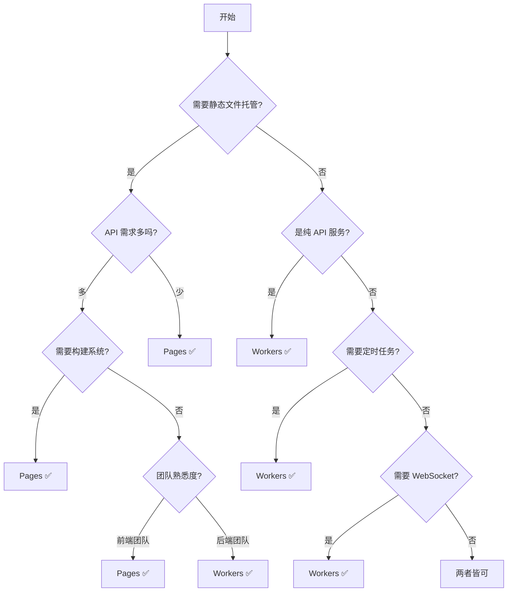

# Cloudflare Workers vs Pages 完全对比指南

> 深入理解两个产品的区别，选择最适合的解决方案

## 目录

- [核心概念对比](#核心概念对比)
- [技术架构差异](#技术架构差异)
- [功能特性对比](#功能特性对比)
- [使用场景分析](#使用场景分析)
- [性能和限制对比](#性能和限制对比)
- [成本分析](#成本分析)
- [选择决策树](#选择决策树)
- [混合使用策略](#混合使用策略)
- [实战案例](#实战案例)

---

## 核心概念对比

### Cloudflare Workers
**定位**：无服务器计算平台，运行后端逻辑
**本质**：JavaScript/TypeScript 运行时，处理 HTTP 请求

### Cloudflare Pages
**定位**：JAMstack 平台，托管静态网站
**本质**：静态文件托管 + Pages Functions（基于 Workers）

### 一句话区别
- **Workers**：你写的是一个完整的服务器应用
- **Pages**：你部署的是一个网站（可选添加后端功能）

---

## 技术架构差异

### Workers 架构

```
请求 → Workers Runtime → 你的代码处理一切 → 响应
         ↓
    可以返回HTML、JSON、二进制等任何内容
```

```javascript
// Workers - 完全控制请求处理
export default {
  async fetch(request, env, ctx) {
    const url = new URL(request.url);
    
    // 你需要自己处理所有路由
    if (url.pathname === '/') {
      return new Response('<h1>Home</h1>', {
        headers: { 'Content-Type': 'text/html' }
      });
    }
    
    if (url.pathname === '/api/data') {
      return Response.json({ data: 'value' });
    }
    
    if (url.pathname.startsWith('/static/')) {
      // 需要自己处理静态文件
      return fetch(`https://cdn.example.com${url.pathname}`);
    }
    
    return new Response('Not Found', { status: 404 });
  }
}
```

### Pages 架构

```
请求 → Pages 路由系统
         ↓
    静态文件? → 直接返回文件
         ↓
    /api/* 或 Functions? → Pages Functions 处理
         ↓
    都不是? → 返回 404 或 index.html（SPA）
```

```javascript
// Pages Functions - functions/api/hello.js
// 自动处理 /api/hello 路由
export async function onRequest(context) {
  return Response.json({ message: 'Hello' });
}

// 静态文件自动托管，无需编写代码
// public/
//   ├── index.html      → /
//   ├── about.html      → /about
//   ├── css/style.css   → /css/style.css
//   └── js/app.js       → /js/app.js
```

---

## 功能特性对比

### 详细功能对比表

| 功能特性 | Workers | Pages | 说明 |
|---------|---------|-------|------|
| **静态文件托管** | ❌ 需手动实现 | ✅ 原生支持 | Pages 自动处理静态资源 |
| **自动路由** | ❌ 手动编写 | ✅ 文件系统路由 | Pages 基于文件结构自动路由 |
| **Git 集成** | ❌ 需 CI/CD | ✅ 自动部署 | Pages 支持 GitHub/GitLab 集成 |
| **预览环境** | ⚠️ 需配置 | ✅ 每个 PR 自动 | Pages 为每个 PR 创建预览 URL |
| **自定义域名** | ✅ 支持 | ✅ 支持 | 都支持自定义域名 |
| **API 端点** | ✅ 完全控制 | ✅ Pages Functions | Workers 更灵活 |
| **WebSocket** | ✅ 支持 | ⚠️ 仅 Functions | Workers 原生支持 |
| **定时任务** | ✅ Cron Triggers | ❌ 不支持 | 只有 Workers 支持 |
| **队列消费** | ✅ Queue Consumer | ❌ 不支持 | 只有 Workers 支持 |
| **Durable Objects** | ✅ 支持 | ⚠️ 仅 Functions | Workers 完整支持 |
| **中间件** | ✅ 自己实现 | ✅ 内置支持 | Pages Functions 有中间件链 |
| **重定向规则** | ❌ 代码实现 | ✅ _redirects 文件 | Pages 支持配置文件 |
| **请求头规则** | ❌ 代码实现 | ✅ _headers 文件 | Pages 支持配置文件 |
| **构建系统** | ❌ 无 | ✅ 内置 | Pages 支持各种框架构建 |
| **环境变量** | ✅ wrangler.toml | ✅ 仪表板配置 | Pages 更易管理 |
| **分析** | ✅ Workers Analytics | ✅ Web Analytics | Pages 有更丰富的分析 |

### Workers 独有功能

```javascript
// 1. Cron Triggers - 定时任务
export default {
  async scheduled(event, env, ctx) {
    // 每小时执行一次
    await cleanupOldData(env);
  },
  
  async fetch(request, env, ctx) {
    // 常规 HTTP 处理
  }
}

// wrangler.toml
// [triggers]
// crons = ["0 * * * *"]

// 2. Queue Consumer - 消息队列
export default {
  async queue(batch, env, ctx) {
    for (const message of batch.messages) {
      await processMessage(message);
      message.ack();
    }
  }
}

// 3. TCP Sockets (beta)
export default {
  async fetch(request, env, ctx) {
    const socket = new Socket({
      address: 'tcp.example.com',
      port: 8080
    });
    
    await socket.connect();
    await socket.write('Hello TCP');
    const response = await socket.read();
    
    return new Response(response);
  }
}

// 4. 完全自定义路由
export default {
  async fetch(request, env, ctx) {
    const router = new Router();
    
    router.get('/users/:id', async ({ params }) => {
      return Response.json({ userId: params.id });
    });
    
    router.post('/api/*', async (request) => {
      // 处理所有 API 请求
    });
    
    return router.handle(request);
  }
}
```

### Pages 独有功能

```javascript
// 1. 文件系统路由
// functions/api/users/[id].js
export function onRequestGet({ params }) {
  return Response.json({ userId: params.id });
}

// 2. 中间件链
// functions/_middleware.js
export async function onRequest(context) {
  const { request, next } = context;
  
  // 认证检查
  if (!request.headers.get('Authorization')) {
    return new Response('Unauthorized', { status: 401 });
  }
  
  // 继续处理
  const response = await next();
  
  // 添加响应头
  response.headers.set('X-Custom', 'value');
  
  return response;
}

// 3. 静态文件配置
// _redirects
/old-page /new-page 301
/api/* https://api.backend.com/:splat 200

// _headers
/static/*
  Cache-Control: public, max-age=31536000
  
/*.js
  Content-Type: application/javascript
  X-Content-Type-Options: nosniff

// 4. 框架预设
// 自动识别并构建：
// - React (Create React App, Next.js)
// - Vue (Vue CLI, Nuxt)
// - Angular
// - Svelte (SvelteKit)
// - Astro, Gatsby, Hugo, Jekyll, 等等
```

---

## 使用场景分析

### Workers 最适合的场景

#### 1. 纯 API 服务
```javascript
// RESTful API 服务
export default {
  async fetch(request, env) {
    const api = new API(env);
    
    return api
      .route('GET', '/users', getAllUsers)
      .route('POST', '/users', createUser)
      .route('GET', '/users/:id', getUser)
      .route('PUT', '/users/:id', updateUser)
      .route('DELETE', '/users/:id', deleteUser)
      .handle(request);
  }
}
```

**为什么选 Workers**：
- 不需要静态文件托管
- 需要完全控制路由
- 需要高性能 API

#### 2. 微服务/中间件
```javascript
// 认证网关
export default {
  async fetch(request, env) {
    // 验证 JWT
    const token = request.headers.get('Authorization');
    const valid = await verifyJWT(token, env.JWT_SECRET);
    
    if (!valid) {
      return new Response('Unauthorized', { status: 401 });
    }
    
    // 代理到后端
    return fetch('https://backend.internal' + request.url, {
      headers: {
        ...request.headers,
        'X-User-Id': getUserId(token)
      }
    });
  }
}
```

**为什么选 Workers**：
- 作为独立服务运行
- 不需要前端界面
- 需要处理所有类型的请求

#### 3. 实时应用
```javascript
// WebSocket 服务器
export default {
  async fetch(request, env) {
    if (request.headers.get('Upgrade') === 'websocket') {
      const pair = new WebSocketPair();
      const [client, server] = Object.values(pair);
      
      handleWebSocket(server, env);
      
      return new Response(null, {
        status: 101,
        webSocket: client
      });
    }
    
    return new Response('WebSocket server');
  }
}
```

**为什么选 Workers**：
- 需要 WebSocket 支持
- 需要持久连接
- 需要实时通信

#### 4. 定时任务/后台处理
```javascript
// 数据同步服务
export default {
  async scheduled(event, env) {
    // 每天凌晨 2 点执行
    const data = await fetchExternalData();
    await env.DB.prepare('INSERT INTO ...').run();
    
    // 发送报告
    await sendEmail(env);
  },
  
  async queue(batch, env) {
    // 处理异步任务
    for (const message of batch.messages) {
      await processJob(message.body);
      message.ack();
    }
  }
}
```

**为什么选 Workers**：
- 需要 Cron 触发器
- 需要队列处理
- 纯后端任务

### Pages 最适合的场景

#### 1. 静态网站 + API
```
my-blog/
├── public/
│   ├── index.html
│   ├── blog/
│   │   ├── post1.html
│   │   └── post2.html
│   └── css/style.css
└── functions/
    └── api/
        ├── posts.js       # API: 获取文章列表
        └── comments.js    # API: 评论功能
```

**为什么选 Pages**：
- 主要是静态内容
- 少量 API 需求
- 需要 CDN 加速

#### 2. SPA 应用（React/Vue/Angular）
```javascript
// React 应用 + API
// 自动构建和部署

// functions/api/auth.js
export async function onRequestPost({ request, env }) {
  const { username, password } = await request.json();
  const user = await authenticate(username, password, env);
  
  if (user) {
    const token = await generateJWT(user, env);
    return Response.json({ token });
  }
  
  return new Response('Invalid credentials', { status: 401 });
}
```

**为什么选 Pages**：
- 前端框架自动构建
- Git 集成自动部署
- 预览环境支持

#### 3. 文档网站
```
docs-site/
├── public/
│   ├── index.html
│   ├── docs/
│   │   ├── getting-started.html
│   │   ├── api-reference.html
│   │   └── guides/
│   └── search.json
├── functions/
│   └── api/
│       └── search.js  # 搜索 API
└── _redirects         # 重定向规则
    /v1/* /docs/v1/:splat 301
    /latest/* /docs/v2/:splat 302
```

**为什么选 Pages**：
- 内容为主
- 需要良好的 SEO
- 简单的搜索功能

#### 4. 营销网站/落地页
```html
<!-- 营销网站with表单处理 -->
<!-- public/index.html -->
<form action="/api/subscribe" method="POST">
  <input name="email" type="email" required>
  <button>订阅</button>
</form>

<!-- functions/api/subscribe.js -->
export async function onRequestPost({ request, env }) {
  const formData = await request.formData();
  const email = formData.get('email');
  
  // 保存到数据库
  await env.DB.prepare('INSERT INTO subscribers...').run();
  
  // 发送欢迎邮件
  await sendWelcomeEmail(email, env);
  
  return Response.redirect('/thank-you');
}
```

**为什么选 Pages**：
- 静态内容为主
- 简单的表单处理
- 需要快速迭代

---

## 性能和限制对比

### 性能指标

| 指标 | Workers | Pages | 说明 |
|------|---------|-------|------|
| **冷启动** | < 5ms | < 5ms (Functions) | 静态文件无冷启动 |
| **静态文件** | N/A | < 10ms | Pages 针对静态优化 |
| **全球延迟** | < 50ms | < 30ms (静态) | Pages 静态文件更快 |
| **并发请求** | 无限制 | 无限制 | 都可自动扩展 |
| **CPU 时间** | 10ms-30s | 10ms-30s | 付费计划可更高 |

### 限制对比

| 限制项 | Workers Free | Workers Paid | Pages Free | Pages Paid |
|--------|-------------|--------------|------------|------------|
| **请求/天** | 100,000 | 无限制 | 无限制 | 无限制 |
| **请求/月** | 1000万 | 按量付费 | 无限制 | 无限制 |
| **CPU 时间** | 10ms | 30s | 10ms | 30s |
| **内存** | 128MB | 128MB | 128MB | 128MB |
| **脚本大小** | 1MB | 10MB | 1MB | 10MB |
| **环境变量** | 64个 | 64个 | 64个 | 64个 |
| **KV 操作** | 1000/天 | 按量付费 | 1000/天 | 按量付费 |
| **构建时间** | N/A | N/A | 20分钟 | 20分钟 |
| **并发构建** | N/A | N/A | 1 | 5 |
| **部署/月** | 无限制 | 无限制 | 500 | 5000 |
| **带宽** | 无限制 | 无限制 | 无限制 | 无限制 |

### 文件大小限制

**Workers**：
- 压缩后 1MB（免费）
- 压缩后 10MB（付费）
- 单个文件最大 25MB（使用 R2）

**Pages**：
- 单个文件最大 25MB
- 总计最多 20,000 个文件
- 总大小无限制

---

## 成本分析

### Workers 成本结构

```
免费额度：
- 每天 100,000 请求
- 每月 1000 万请求

付费（$5/月起）：
- 前 1000 万请求包含在内
- 超出部分 $0.50/百万请求
- CPU 时间额外计费

示例：
- 月 5000 万请求
- 成本：$5 + (40 * $0.50) = $25
```

### Pages 成本结构

```
免费额度：
- 无限请求（静态文件）
- 每月 500 次构建
- 1 个并发构建

付费（$20/月起）：
- 无限请求
- 每月 5000 次构建
- 5 个并发构建
- Pages Functions 按 Workers 计费

示例：
- 静态网站 + 少量 API
- 成本：$0（免费层足够）
```

### 成本对比示例

#### 场景 1：博客网站（月 100 万访问）
- **Workers**: $5/月（需要处理所有请求）
- **Pages**: $0/月（静态文件免费）
- **推荐**: Pages ✅

#### 场景 2：API 服务（月 5000 万请求）
- **Workers**: $25/月
- **Pages Functions**: $25/月（相同）
- **推荐**: Workers ✅（更适合纯 API）

#### 场景 3：SaaS 应用（前端+API）
- **Workers**: $25/月（处理一切）
- **Pages**: $20/月（构建）+ $5（Functions）= $25/月
- **推荐**: Pages ✅（更好的开发体验）

---

## 选择决策树



### 快速决策指南

**选择 Workers 如果**：
- ✅ 纯 API 服务
- ✅ 需要定时任务
- ✅ 需要队列处理
- ✅ 需要 WebSocket
- ✅ 微服务架构
- ✅ 复杂的路由逻辑
- ✅ 需要完全控制

**选择 Pages 如果**：
- ✅ 静态网站为主
- ✅ SPA 应用
- ✅ 需要 Git 集成
- ✅ 需要预览环境
- ✅ 团队习惯 JAMstack
- ✅ 内容网站
- ✅ 需要快速上线

---

## 混合使用策略

### 策略 1：Pages 前端 + Workers API

```
架构：
┌─────────────┐     ┌──────────────┐
│   Pages     │────▶│   Workers    │
│  (前端SPA)  │     │  (API后端)   │
└─────────────┘     └──────────────┘
       ↓                    ↓
   静态文件CDN          业务逻辑处理
```

**实现方式**：
```javascript
// Pages - 前端应用
// public/app.js
const API_URL = 'https://api.example.workers.dev';

async function fetchData() {
  const response = await fetch(`${API_URL}/data`);
  return response.json();
}

// Workers - API 后端
export default {
  async fetch(request, env) {
    // 设置 CORS
    const headers = {
      'Access-Control-Allow-Origin': 'https://app.example.pages.dev',
      'Content-Type': 'application/json'
    };
    
    // 处理 API 请求
    return Response.json({ data: 'value' }, { headers });
  }
}
```

### 策略 2：Workers 路由 + Pages 内容

```javascript
// Workers 作为主入口，代理到 Pages
export default {
  async fetch(request, env) {
    const url = new URL(request.url);
    
    // API 请求自己处理
    if (url.pathname.startsWith('/api/')) {
      return handleAPI(request, env);
    }
    
    // 静态内容代理到 Pages
    return fetch(`https://content.pages.dev${url.pathname}`);
  }
}
```

### 策略 3：多个 Pages 项目组合

```
主站（Pages）: example.com
├── 博客（Pages）: blog.example.com
├── 文档（Pages）: docs.example.com
├── API（Workers）: api.example.com
└── 管理后台（Pages）: admin.example.com
```

---

## 实战案例

### 案例 1：电商网站

**需求分析**：
- 产品展示页面（静态）
- 购物车（动态）
- 用户认证
- 订单处理
- 支付集成

**推荐方案**：Pages + Functions
```
ecommerce-site/
├── public/
│   ├── index.html         # 首页
│   ├── products/          # 产品页面
│   └── assets/            # 静态资源
├── functions/
│   ├── api/
│   │   ├── auth.js        # 认证
│   │   ├── cart.js        # 购物车
│   │   ├── orders.js      # 订单
│   │   └── payment.js     # 支付
│   └── _middleware.js     # 认证中间件
└── wrangler.toml
```

**为什么选 Pages**：
- 产品页面可以静态生成
- Functions 足够处理 API
- Git 集成方便部署

### 案例 2：实时协作工具

**需求分析**：
- WebSocket 连接
- 实时数据同步
- 用户状态管理
- 持久化存储

**推荐方案**：Workers + Durable Objects
```javascript
// Workers 实现
export class CollaborationRoom {
  constructor(state, env) {
    this.state = state;
    this.sessions = [];
  }
  
  async fetch(request) {
    // WebSocket 处理
    const pair = new WebSocketPair();
    this.handleSession(pair[1]);
    
    return new Response(null, {
      status: 101,
      webSocket: pair[0]
    });
  }
  
  handleSession(webSocket) {
    // 实时协作逻辑
    webSocket.accept();
    this.sessions.push(webSocket);
    
    webSocket.addEventListener('message', event => {
      // 广播给其他用户
      this.broadcast(event.data, webSocket);
    });
  }
}
```

**为什么选 Workers**：
- 需要 WebSocket
- 需要 Durable Objects
- 实时性要求高

### 案例 3：企业官网

**需求分析**：
- 公司介绍
- 产品展示
- 新闻博客
- 联系表单
- 多语言支持

**推荐方案**：Pages
```
corporate-site/
├── public/
│   ├── index.html
│   ├── about/
│   ├── products/
│   ├── blog/
│   └── locales/         # 多语言
├── functions/
│   └── api/
│       └── contact.js    # 表单处理
├── _redirects            # URL 重定向
└── _headers              # 缓存策略
```

**为什么选 Pages**：
- 内容为主
- 更新不频繁
- SEO 重要
- 简单的表单处理

### 案例 4：API 网关

**需求分析**：
- 请求路由
- 认证授权
- 限流
- 日志记录
- 请求转换

**推荐方案**：Workers
```javascript
export default {
  async fetch(request, env, ctx) {
    // 限流检查
    const rateLimitOk = await checkRateLimit(request, env);
    if (!rateLimitOk) {
      return new Response('Too Many Requests', { status: 429 });
    }
    
    // 认证
    const auth = await authenticate(request, env);
    if (!auth.valid) {
      return new Response('Unauthorized', { status: 401 });
    }
    
    // 路由到后端服务
    const backend = selectBackend(request.url);
    const response = await fetch(backend, {
      headers: {
        ...request.headers,
        'X-User-Id': auth.userId
      }
    });
    
    // 记录日志
    ctx.waitUntil(logRequest(request, response, env));
    
    return response;
  }
}
```

**为什么选 Workers**：
- 纯 API 服务
- 需要灵活路由
- 中间件功能
- 不需要静态文件

---

## 迁移指南

### 从 Workers 迁移到 Pages

```javascript
// Workers 原代码
export default {
  async fetch(request, env) {
    const url = new URL(request.url);
    
    if (url.pathname === '/') {
      return new Response(HTML_CONTENT, {
        headers: { 'Content-Type': 'text/html' }
      });
    }
    
    if (url.pathname === '/api/data') {
      return Response.json(await getData(env));
    }
    
    return new Response('Not Found', { status: 404 });
  }
}

// 迁移到 Pages
// 1. 将 HTML 放到 public/index.html
// 2. 创建 functions/api/data.js
export async function onRequest({ env }) {
  return Response.json(await getData(env));
}
```

### 从 Pages 迁移到 Workers

```javascript
// Pages Functions
// functions/api/users/[id].js
export async function onRequestGet({ params, env }) {
  const user = await getUser(params.id, env);
  return Response.json(user);
}

// 迁移到 Workers
import { Router } from 'itty-router';

const router = Router();

router.get('/api/users/:id', async ({ params }, env) => {
  const user = await getUser(params.id, env);
  return Response.json(user);
});

export default {
  async fetch(request, env) {
    return router.handle(request, env);
  }
}
```

---

## 总结和建议

### 核心原则

1. **内容驱动选 Pages**
   - 静态内容多
   - SEO 重要
   - 需要 CDN

2. **逻辑驱动选 Workers**
   - API 为主
   - 复杂业务逻辑
   - 需要后台任务

3. **开发体验优先选 Pages**
   - Git 集成
   - 自动部署
   - 预览环境

4. **性能要求高选 Workers**
   - 完全控制
   - 自定义优化
   - 特殊需求

### 最终建议

**新项目默认选择策略**：
1. 先考虑 Pages（开发体验好）
2. 如果 Pages 不满足，再选 Workers
3. 复杂项目可以混合使用

**团队因素**：
- 前端团队 → Pages
- 后端团队 → Workers
- 全栈团队 → 根据项目选择

**未来趋势**：
- Pages 和 Workers 功能越来越接近
- Pages Functions 基本等同于 Workers
- 选择更多基于开发体验而非功能差异

---

## 快速参考

### Workers 项目初始化
```bash
npm create cloudflare@latest my-worker
# 选择 "Hello World" Worker
cd my-worker
npm run dev
npm run deploy
```

### Pages 项目初始化
```bash
npm create cloudflare@latest my-site
# 选择框架或 "None"
cd my-site
npm run dev
npm run build
npm run deploy

# 或通过 Git
# 1. 推送到 GitHub
# 2. 在 Cloudflare Dashboard 连接仓库
# 3. 自动部署
```

### 配置文件对比

**Workers (wrangler.toml)**：
```toml
name = "my-worker"
main = "src/index.js"
compatibility_date = "2024-01-01"

[env.production]
vars = { API_KEY = "secret" }
kv_namespaces = [
  { binding = "KV", id = "xxx" }
]
```

**Pages (无需配置文件)**：
- 环境变量：Dashboard 设置
- 构建命令：Dashboard 设置
- Functions：自动识别 functions/ 目录

---

*选择 Workers 还是 Pages，关键是理解你的需求核心是内容还是逻辑。*